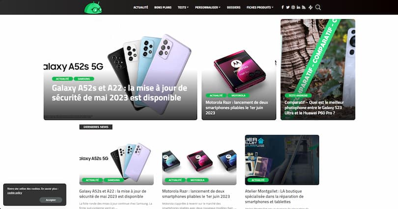
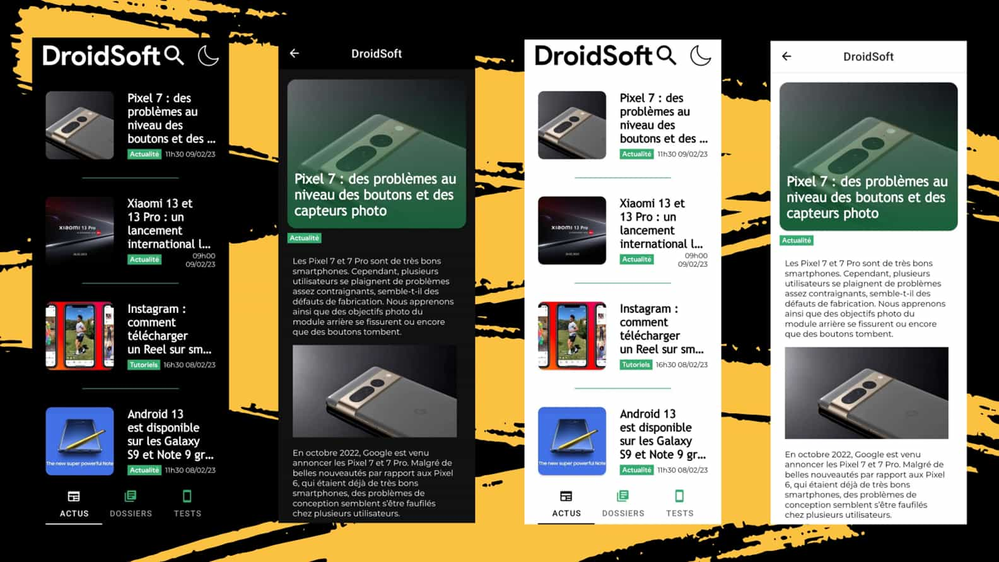
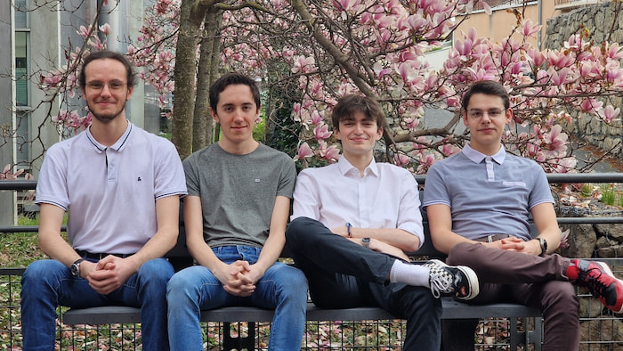
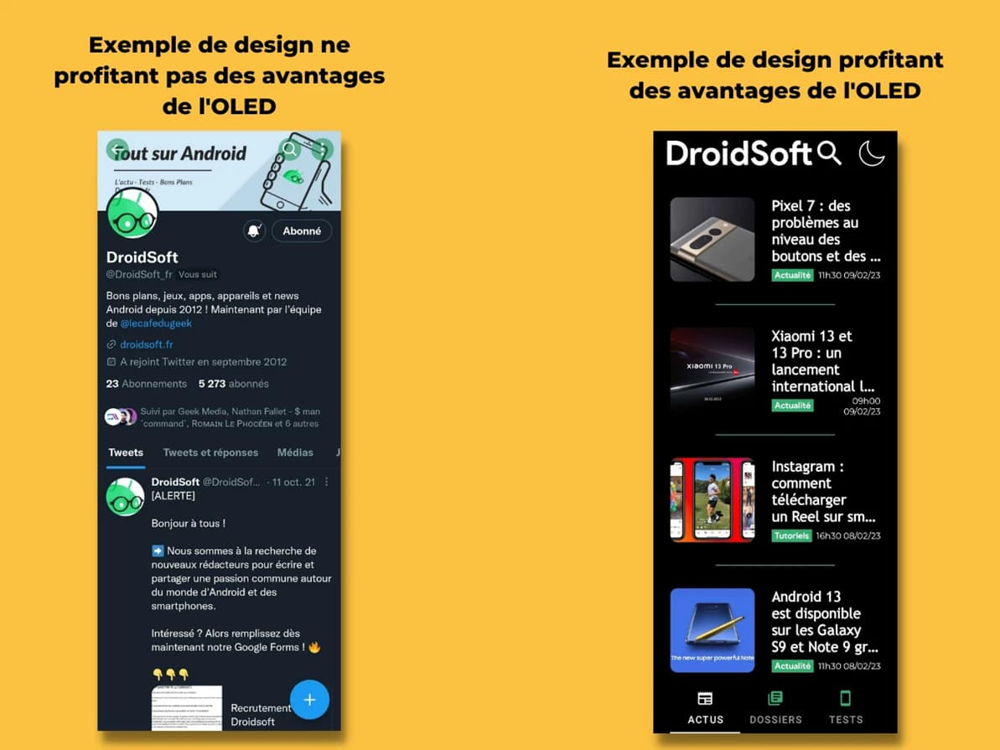

+++
title = 'Le média DroidSoft.fr se dote d’une nouvelle application mobile grâce au travail de nos étudiants'
date = 2023-06-13
draft = false
tags = ["Réalisation étudiant"]
type = "Réalisation étudiant"
+++

  

Dans le cadre du BUT Informatique Graphique, les étudiants de deuxième année sont tenus de réaliser un projet tutoré sur l’année. Ces projets sont généralement proposés par des entreprises ou peuvent être initiés par les étudiants eux-mêmes.

Dans cet article, nous vous présentons un projet réalisé sur l’année 2022-2023 par un groupe de quatre étudiants, portant sur le développement d’une application mobile. Celle-ci est à destination d’un média orienté sur les nouvelles technologies du monde d’Android, [DroidSoft.fr](https://droidsoft.fr/). Ce média _tech_ est spécialisé dans l’univers d’Android. Il couvre les dernières innovations en matière de smartphones, tablettes, montres connectées, écouteurs et autres produits de cet écosystème.

  

## LA GENÈSE DU PROJET DE MODERNISATION D’UNE APPLICATION POUR DROIDSOFT

DroidSoft cherchait à moderniser une application vieillissante présente sur le Play Store. Le média souhaitait offrir une expérience utilisateur plus attrayante et consolider la notion de communauté parmi ses utilisateurs.

En effet, dans un paysage où les applications similaires sont de moins en moins utilisées pour la découverte de médias, mais plutôt pour la fidélisation des utilisateurs, il était important de repenser l’application pour répondre aux besoins de la communauté DroidSoft.

L’équipe en charge du pojet était composée de : [Eliot Bianchin](https://www.linkedin.com/in/eliot-bianchin/), [Lucas Chalmandrier](https://www.linkedin.com/in/lucas-chalmandrier/), [Quentin Detré](https://www.linkedin.com/in/quentin-detr%C3%A9/) et [Maximilien Herr](https://www.linkedin.com/in/maximilien-herr/). Leur mission consistait à recréer l’application en modernisant son design tout en préservant sa fonctionnalité essentielle : informer et conseiller les lecteurs.

<figure>
  <picture>
    <!-- AVIF -->
    <source type="image/avif" srcset="img/Capture-decran-du-site-internet-de-DroidSoft-2.avif">
    <!-- JPEG de repli pour les navigateurs qui ne supportent pas AVIF -->
    
  </picture>
  <figcaption><em>Capture d’écran du site internet du média DroidSoft</em></figcaption>
</figure>

## SÉLECTION DES TECHNOLOGIES POUR LE DÉVELOPPEMENT DE L’APPLICATION

Les projets tutorés ont débuté en novembre 2022, alors que les étudiants n’avaient pas encore été formés au développement d’applications mobiles. Pour ce projet, leur mission était de créer une application mobile pour Android, ce qui peut être réalisé à l’aide d’Android Studio.

Il y avait deux options pour le choix du langage de programmation : Java ou Kotlin. Java est le langage le plus ancien des deux et est largement connu. En revanche, Kotlin est mis en avant par Google, qui détient Android. Il est considéré comme un langage moderne et dans l’air du temps. Par conséquent, Kotlin a été retenu pour le développement de l’application.

<figure>
  <picture>
    <!-- AVIF -->
    <source type="image/avif" srcset="img/Capture-decran-resultat-final.avif">
    <!-- WebP -->
    <source type="image/webp" srcset="img/Capture-decran-resultat-final.webp">
    <!-- JPEG de repli pour les navigateurs qui ne supportent ni AVIF ni WebP -->
    
  </picture>
  <figcaption><em>Captures d’écran du résultat de l’application développée par les étudiants du département informatique graphique</em></figcaption>
</figure>

## LES QUATRE GRANDES ÉTAPES DU DÉVELOPPEMENT DE L’APPLICATION

Le projet peut se décomposer en quatre grandes étapes :

*   La conception du design (Interface Utilisateur et Expérience Utilisateur)
*   La communication avec des API pour récupérer les données des articles du site DroidSoft.fr
*   Le développement de l’application en elle-même avec les technologies retenues précédemment
*   La création d’une API et d’une base de données permettant de récupérer les informations relatives aux dernières sorties technologiques dans le monde d’Android (comme les derniers smartphones d’une marque en particulier…)

## 700 HEURES DE TRAVAIL EN ÉQUIPE

L’équipe s’est réparti les missions comme suit :

*   Eliot était le designer de l’équipe. Son rôle était de créer les maquettes de l’application en lien étroit avec le client. Il avait aussi la charge de la promotion du projet.
*   Lucas et Quentin avaient pour mission de réaliser l’implémentation de fonctionnalités du cahier des charges au sein de l’application.
*   Quant à Maximilien, il gérait le projet et faisait le pont avec le client, tout en s’assurant de l’avancement de l’équipe. Par ailleurs, pour la partie technique, il a créé l’API et la base de données précisés plus tôt.

Au total, l’équipe a travaillé pendant près de 700 heures pour concevoir et développer l’application, en respectant les exigences du client et les délais fixés par l’Université.

<figure>
  <picture>
    <!-- AVIF -->
    <source type="image/avif" srcset="img/equipe-developpement-application-droidsoft-Eliot-Maximilien-Lucas-Quentin.avif">
    <!-- WebP -->
    <source type="image/webp" srcset="img/equipe-developpement-application-droidsoft-Eliot-Maximilien-Lucas-Quentin.webp">
    <!-- JPEG de repli pour les navigateurs qui ne supportent ni AVIF ni WebP -->
    
  </picture>
  <figcaption><em>Équipe ayant réalisé le développement de l’application pour le média DroidSoft. De gauche à droite : Quentin, Lucas, Eliot et Maximilien.</em></figcaption>
</figure>

## VERS UNE MÉTHODOLOGIE PROFESSIONNELLE : DÉVELOPPEMENT COLLABORATIF ET CONTRÔLE DE VERSION AVEC GIT

Les projets confiés à nos étudiants présentent des similitudes avec les missions confiées au sein d’une entreprise. Par conséquent, ils ont cherché à recréer un environnement de travail similaire à celui du monde du travail.

Ils sont partis d’un projet open source fourni par le client. La première difficulté rencontrée a été de comprendre le code existant afin de pouvoir le modifier et l’étendre.

Pour faciliter le travail en équipe, ils ont utilisé des systèmes de contrôle de version, en l’occurrence Git. Cela a permis à chaque développeur de partir d’une base commune, de créer de manière indépendante une fonctionnalité, puis de l’intégrer à la version principale du projet une fois celle-ci terminée. Ce processus garantit qu’une version fonctionnelle est constamment disponible et permet de travailler simultanément mais de manière séparée.

  

## INTÉGRER LE GREEN IT : L’UTILISATION DE LA TECHNOLOGIE OLED DANS UNE APPLICATION MOBILE

Les étudiants ont été sensibilisés au [numérique responsable](https://ig.iut-clermont.fr/news/le-numerique-responsable-au-coeur-de-la-formation/) et au Green IT durant leur formation. Dans ce projet, cette sensibilité se retrouve dans le choix des langages de programmation, dans la qualité du code écrit et plus particulièrement dans le design.

En effet, la plupart des smartphones aujourd’hui sont équipés d’un écran avec la technologie OLED. Cette technologie permet de réduire l’impact énergétique des téléphones, car elle permet que chaque pixel de l’écran soit autonome. Ainsi, si celui-ci doit afficher une couleur noire, il s’éteint tout simplement. Cela s’oppose au LCD, qui rétro-éclaire les pixels, dont la lumière est commune à plusieurs pixels.

C’est l’exploitation de cette technologie « plus verte », par la création d’un thème sombre utilisant principalement la couleur noire, qui a été proposée par les étudiants, et retenue par le client.

<figure>
  <picture>
    <!-- AVIF -->
    <source type="image/avif" srcset="img/Design-OLED-application-DroidSoft.avif">
    <!-- WebP -->
    <source type="image/webp" srcset="img/Design-OLED-application-DroidSoft.webp">
    <!-- JPEG de repli pour les navigateurs qui ne supportent ni AVIF ni WebP -->
    
  </picture>
</figure>

## UNE APPLICATION FONCTIONNELLE PRÊTE À ÊTRE DÉPLOYÉE ET UTILISÉE PAR DROIDSOFT

Grâce à leur sérieux, nos étudiants ont pleinement satisfait le cahier des charges initial. Les échanges réguliers avec le client ont permis à Quentin, Lucas, Eliot et Maximilien d’adapter la trajectoire du projet en fonction de l’évolution de ses attentes. Ainsi, DroidSoft dispose désormais de l’application moderne qu’elle méritait !

Les étudiants ont partagé le code source avec DroidSoft, lui permettant ainsi de maintenir et de poursuivre le développement de l’application. Le client est satisfait du résultat et les enseignants sont fiers du travail accompli.

Si vous souhaitez découvrir plus précisément le projet, vous pouvez consulter le [site Internet de promotion de celui-ci](https://maximilienherr.fr/droidsoft-app/).

 _Cet article a été rédigé par_ [_Maximilien Herr_](https://maximilienherr.fr/).