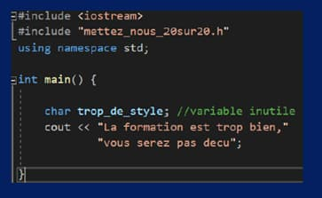
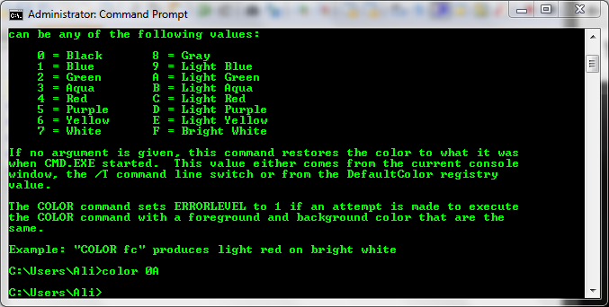
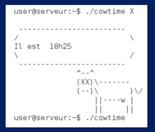
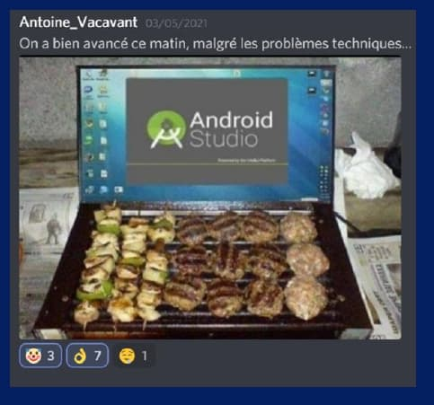
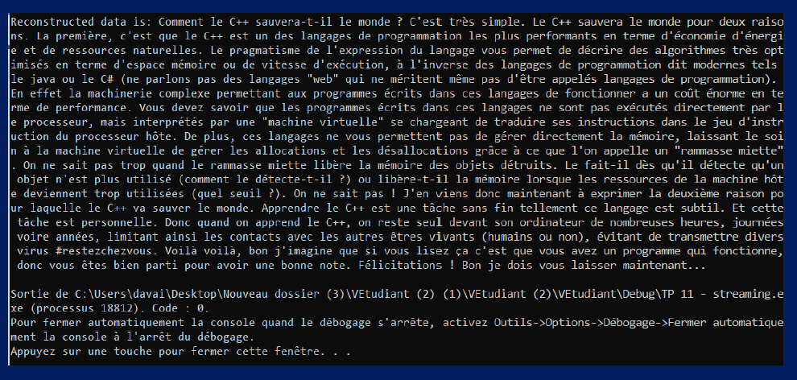

+++
title = 'La guerre des langages'
date = 2021-08-25
draft = false
+++

Au département Informatique Graphique, chaque enseignant est spécialisé dans l’enseignement d’un langage de programmation : C++, Shell, PHP, HTML, CSS, Java… Et quand il s’agit de défendre leurs avantages, ils dégainent les arguments **à la vitesse d’un sabre laser**. Dans cet article, nous souhaitions partager avec vous la joute digitale à laquelle vous prendrez part en arrivant à l’IUT : **la guerre des langages**.

<figure>
  <picture>
    <!-- AVIF -->
    <source type="image/avif" srcset="img/la-guerre-des-langages-1-768x432.avif">
    <!-- WebP -->
    <source type="image/webp" srcset="img/la-guerre-des-langages-1-768x432.webp">
    <!-- JPEG de repli pour les navigateurs qui ne supportent ni AVIF ni WebP -->
    
  </picture>
</figure> 

Pour les novices en programmation, rappelons qu’un langage est une suite de mots respectant une certaine syntaxe. C’est une notation conventionnelle destinée à formuler des algorithmes et à produire des programmes informatiques. Il en existe plusieurs. Tout langage a une utilisation, une complexité et une rapidité qui lui est propre.

  

## **Le C++, la complexité au service de l’efficacité**

Créé en 1980, le C++ est un langage de programmation orientée objet. Il est souvent utilisé pour développer des logiciels, des systèmes d’exploitation, des jeux vidéo ou encore des moteurs de recherche.

C’est le premier langage que vous apprendrez en cours. Peut-être parce que c’est le meilleur ? En tout cas **M. Albouy-Kissi, maitre Jedi du C++,** ne dira pas le contraire : « C’est un des langages les plus économes en termes d’énergie et de ressources. Il permet de développer des algorithmes optimisés qu’il s’agisse de mémoire ou de vitesse d’exécution. Il est considéré comme le meilleur quand il s’agit de créer des applications à grande échelle. »

<figure>
  <picture>
    <!-- AVIF -->
    <source type="image/avif" srcset="img/cplusplus.avif">
    <!-- WebP -->
    <source type="image/webp" srcset="img/cplusplus.webp">
    <!-- JPEG de repli pour les navigateurs qui ne supportent ni AVIF ni WebP -->
    
  </picture>
</figure> 

Son talon d’Achille ? Il est relativement complexe à maîtriser. Actuellement, de nombreuses entreprises utilisent le C++ mais ne savent pas l’optimiser. Les fonctionnalités de gestion de mémoire ou de changement de type d’une variable sont des possibilités assez récentes et méconnues.

  

### **Le Shell, une interface système peu intuitive mais indispensable**

Le Shell a vu le jour en 1971. Il est principalement utilisé dans la gestion de serveurs et des ordinateurs embarqués. C’est une interface qui reçoit des commandes informatiques données par un utilisateur à partir de son clavier pour les envoyer au système d’exploitation qui se chargera de les exécuter. Ça ne vous dit toujours rien ? Il est généralement représenté dans les films par l’invite de commande et ses écritures vertes caractéristiques.

<figure>
  <picture>
    
  </picture>
</figure> 

Jeunes **padawans,** M. Bischoff vous l’assure : « Le Shell est le langage essentiel pour un informaticien ! Il est utilisé pour communiquer avec un serveur et lui faire exécuter un script. Le Shell permet d’utiliser de nombreuses fonctions système afin de récupérer des informations précises sur des composants. »

Indispensable oui mais pas parfait ! Son principal défaut, c’est son manque d’ergonomie. Si vous souhaitez coder à même la console, l’interface de programmation – assez primitive – ne vous permet pas de repérer les erreurs facilement. Le Shell n’est généralement pas apprécié par les étudiants bien que les professeurs tentent de le rendre plus attrayant.

<figure>
  <picture>
    
  </picture>
  <figcaption><em>Meuuuh ! 
</em></figcaption>
</figure> 

## **HTML, CSS et PHP pour devenir le Han Solo de la programmation web**

Lorsque vous surfez sur Internet, tous les sites que vous visitez sont codés en langage de programmation web principalement en PHP, HTML, CSS.

Pourquoi ces langages sont si répandus ? La logique d’écriture est assez simple à comprendre, si bien que de nombreuses personnes apprennent en autodidacte. Les outils mis à disposition pour la recherche d’erreur ou de bug sont les plus complets de tous. Ces langages sont multiplateformes et gérés par tous les navigateurs. Les mises à jour sont fréquentes. Aussi, ces langages sont utilisés par une large communauté ; bibliothèques de code, forum d’entraide et d’astuces sont très nombreux.

Les étudiants apprécient particulièrement ce langage : « Ils sont plus accessibles que les autres. Les langages web sont du pain béni parce qu’ils sont faciles – pas comme le C++ – et permettent un tas de possibilités. Le HTML est un langage riche notamment du côté esthétique. »

**Attention jeune Jedi ! Leurs faiblesses, en avoir connaissance tu dois !** Trop faciles d’accès et limités sur plusieurs plans, certains développeurs ne considèrent pas ces langages comme de vrais langages de programmation. D’autre part, il est facile d’obtenir le code source des pages web écrites en HTML.

  

## **Le JAVA, un bon langage pour la programmation orientée objet**

Le langage Java a pour logo une tasse de café car c’est bien connu les développeurs sont adeptes des nuits blanches ! Créé en 1996, on l’utilise principalement pour la réalisation d’applications mobiles.

Le Java est un langage moderne, intuitif et propose plusieurs fonctions relativement simples à maitriser comme la création d’un singleton (patron de conception). Il permet aussi de réaliser des scripts en JavaScript pour le développement web.

**Le côté obscur du Java ?** Son exécution a un coût énorme en performance du fait de son fonctionnement. Si vous faites du développement d’application mobile, le logiciel d’émulation d’un téléphone portable permettra littéralement de faire cuire des saucisses sur votre ordinateur. **Dark Sidius et ses éclairs peuvent aller se rhabiller.**

[Les petites blagues de M. Vacavant à ce sujet sont particulièrement appréciées :](https://ig.iut-clermont.fr/news/un-jeu-en-realite-virtuelle-pour-comprendre-le-principe-de-la-vitesse-de-la-lumiere/)

<figure>
  <picture>
    <!-- AVIF -->
    <source type="image/avif" srcset="img/saucisse-java.avif">
    <!-- WebP -->
    <source type="image/webp" srcset="img/saucisse-java.webp">
    <!-- JPEG de repli pour les navigateurs qui ne supportent ni AVIF ni WebP -->
    
  </picture>
</figure> 

Nous avons fait le tour des principaux langages enseignés durant la formation. Vous serez également initiés aux C, C# et Python. Il y en a pour tous les goûts et assez pour ne pas s’ennuyer.

Même si certains préfèrent  **embrasser un wookie** plutôt que de l’admettre, nous rappelons que chaque langage à des avantages et des inconvénients. La seule façon de déterminer lequel vous allez préférer c’est de pratiquer.

Nous clôturons cet article par l’éloge du C++ par M. Albouy-Kissi 🙂

<figure>
  <picture>
    
  </picture>
</figure> 

Auteurs : Elisa Braun, Thibaud Chaussabel-Blachier, Kevin Davailles