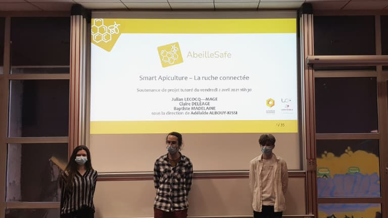
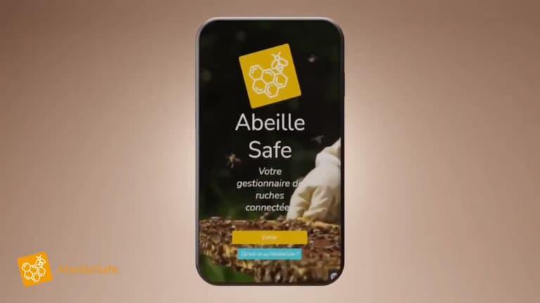

+++
title = 'Abeille Safe, un logiciel de ruche connectée'
date = 2021-04-21
draft = false
tags = ['saucisson']
+++

  

  
Le projet Abeille Safe nait d’une rencontre entre Philippe Beignier, apiculteur loirain et Adélaïde Albouy Kissi, maître de conférences en informatique appliquée au sein du département informatique du Puy-en-Velay.

  

### La genèse du projet

Philippe fait face à une problématique : il lui est impossible de surveiller, avec la même rigueur, l’activité de ses abeilles tout au long de l’année. Les températures basses de l’hiver ne lui permettent pas d’observer la vie à l’intérieur de ses ruches sans risquer d’en faire chuter la température qui doit impérativement être maintenue à 18°C.

Il se questionne : « **Et si, il existait un outil qui puisse m’informer à distance de la santé du nid et de mes ouvrières ?** »

Le département informatique du Puy en Velay attache une importance particulière à mettre les compétences de ses étudiants au profit du développement de l’activité locale. **Adélaïde, sensible aux innovations associant le numérique et l’environnement, est séduite par cette idée de ruche connectée.** Elle mobilise une équipe d’étudiants pour travailler à son déploiement. C’est ainsi que Claire, Julian et Baptiste se lancent dans le développement d’une application destinée à synthétiser les données concernant l’activité et la santé des abeilles. Ce travail est effectué dans le cadre de leur projet tutoré1.

   

### Abeille Safe, c’est quoi exactement ?

**L’application doit permettre à l’apiculteur de rester connecté avec sa ruche à tout moment de l’année** ; il peut surveiller la santé de son essaim grâce à des données journalières. Il est alerté si une anomalie est détectée : une variation importante de la température, de la masse, de l’humidité du nid ou encore sa disparition (grâce à un système de localisation GPS).

Si cet outil rend possible la visualisation précise de la santé de ses abeilles, il constitue aussi **un gain économique important pour l’apiculteur**. Grâce à Abeille Safe ses déplacements sont réduits. En effet, dans la pratique les ruches sont espacées à plusieurs kilomètres de distance. Là où l’apiculteur doit parcourir de longs trajets, la visualisation digitale des données lui permet d’économiser des frais de déplacement et du temps.

**Claire, Julian et Baptiste ont relevé le défi haut la main en proposant un logiciel répondant en tout point au cahier des charges**. Vous pouvez retrouver la description du projet sur leur [site web](https://julmg.alwaysdata.net/abeillesafe/) et découvrir sa présentation vidéo ci-dessous.

https://www.youtube.com/watch?v=ubnqp1hLO50&embeds_referring_euri=https%3A%2F%2Fig.iut-clermont.fr%2F&source_ve_path=MjM4NTE&feature=emb_title
  

### Une touche d’IA pour parfaire le projet

**La partie digitale maintenant développée, il va falloir travailler sur la partie technique pour créer une véritable ruche connectée**. Pour cette phase, l’Université Clermont Auvergne fait appel à la société ponote, Open Studio. Cette agence s’inscrit dans une démarche « numérique responsable » et est liée par contrat à l’université pour développer des projets innovants au service de l’environnement.

La partie technique consiste en la **mise en place de capteurs** capables de récolter les données de la ruche **et d’une intelligence artificielle** capable de les analyser. À terme, cette ruche connectée pourra mesurer et analyser la pollution, le changement climatique, l’apparition ou le développement de nouveaux prédateurs ou parasites. La société ponote est d’ailleurs à la recherche d’un ingénieur spécialisé en électronique et dans les objets connectés qu’elle souhaite dédier intégralement à ce projet.

L’agence digitale Open Studio et l’UCA l’affirment : plus il y aura de ruches connectées et plus les données récoltées seront pertinentes.

**_Affaire à suivre…_**

---
_1\. Un projet tutoré est un travail de groupe (3 à 5 étudiants par équipe) réalisé par des étudiants techniciens de 2ème année qui répond à une problématique professionnelle d’une entreprise ou d’une collectivité. Le suivi du projet est assuré conjointement par l’entreprise et l’école._