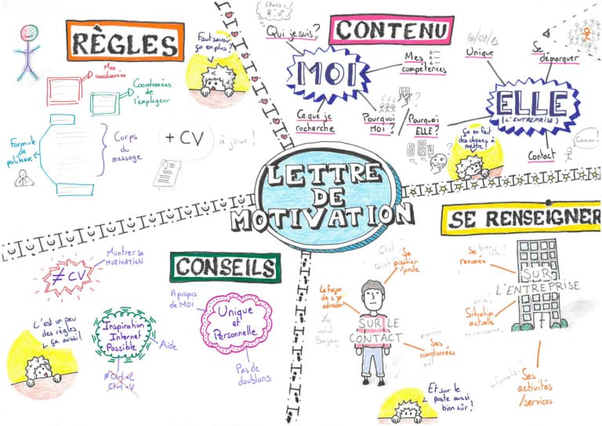
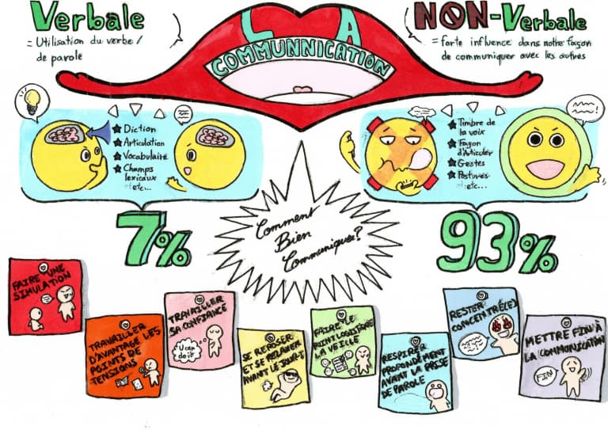

+++
title = ' Nos étudiants apprennent aussi à « sketchnoter »'
date = 2021-03-16
draft = false
tags = ['saucisson']
+++

  

**Le « sketch » quoi ?**

Le sketchnote, ou encore facilitation graphique, est une technique de prise de notes qui fait appel à une panoplie d’outils visuels pour :

*   Prendre des notes
*   Organiser des idées
*   Synthétiser
*   Aider à retenir plus facilement
*   Prendre du recul & clarifier des idées complexes
*   Apprendre
*   Faire une présentation

**Le sketchnote pour outiller nos futurs professionnels de l’informatique**

À la suite de leur formation en B.U.T. Informatique Graphique, nos étudiants sont aptes à intégrer le marché du travail ou à poursuivre leurs études. Chaque matière enseignée leur offre les outils pour devenir des techniciens supérieurs ou des étudiants autonomes. Le stektchnote fait partie des outils récemment éprouvés pour favoriser l’acquisition de cette indépendance intellectuelle.

**Des formes et des couleurs !**

Cette prise de notes peut se faire sur papier ou sur tablette. L’idée est de faire tenir sur une page le sujet choisi (un cours, une présentation, le compte rendu d’une réunion, une étape d’un projet) en utilisant des mots clefs, des formes et des couleurs.

**« Sketchnoter » pour mieux mémoriser**

Le sketchnote favorise le travail de la mémoire. Au lieu d’utiliser une démarche linéaire, le cerveau fait appel à des connexions multiples en associant des idées entre elles. Le sketchnote est dit « neuroergonomique », c’est-à-dire qu’il permet d’allier les mots et les images tout en sollicitant trois de nos sens : le corps (kinesthésique), la vue et/ou l’auditif.

En sollicitant à la fois le corps (dessin) et l’esprit (l’écoute et la création), notre concentration est optimisée.

**Comment procéder pour créer une planche de sketchnote ?**

Pour se lancer, il suffit de respecter les principales étapes :

*   Choisir une forme pour organiser l’information : cercle, tableau, échelle, courbe, quadrillage, etc.
*   Ajouter un titre de manière à le rendre prégnant par rapport à l’ensemble.
*   Exprimer les idées à l’aide de mots clés, de phrases courtes, de dessins, d’icônes, de symboles, etc.
*   Lier ou délimiter les différentes idées par des éléments graphiques, images, flèches, encadrements, puces, etc.

Vous trouverez ci-dessous quelques exemples de planches de sketchnote réalisées par nos étudiants de première année.


  <figure class="grid-w50">
    
    <figcaption><em>La courbe paramétrée par Pierre Vandel</em></figcaption>
  </figure>
  <figure class="grid-w50">
    
    <figcaption><em>Le projet tuteuré par Cyrielle Bracher</em></figcaption>
  </figure>
    <figure class="grid-w50">
    
    <figcaption><em>La lettre de Motivation par Alban Bernard</em></figcaption>
  </figure>
  <figure class="grid-w50">
    
    <figcaption><em>Communication verbale et non-verbale par Marie Morgenthaler</em></figcaption>
  </figure>


