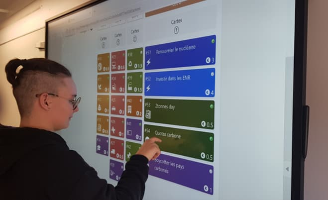
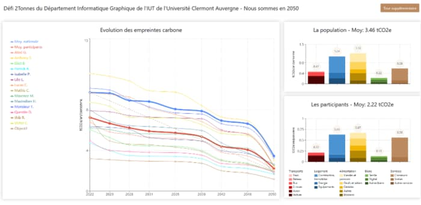

+++
title = 'Le numérique responsable au cœur de la formation'
date = 2022-12-30
draft = false
+++
  

**_Consciente des enjeux écologiques actuels, l’équipe pédagogique du département informatique graphique s’engage pleinement dans une démarche numérique responsable_**.

Selon les sources, l’ensemble de la filière numérique représente entre 2 et 4% des émissions de gaz à effet de serre mondiales, soit autant que le transport aérien. À cela s’ajoute l’épuisement des ressources naturelles nécessaires à la fabrication des dispositifs numériques. Par exemple, l’épuisement des ressources en cuivre est estimé en 2050.

**L’impact environnemental du logiciel n’est lui non plus pas négligeable** car il induit une augmentation des ressources et provoque un raccourcissement de la durée de vie des matériels. Sans un regard responsable, les développeurs de logiciels ont une tendance à ajouter des fonctionnalités superflues et non optimisées, on parle alors d’_obésiciels_.

Au début de l’informatique moderne, en 1969, nous avons envoyé des hommes sur la Lune grâce à un ordinateur uniquement doté de 70 kilo-octets de mémoire, alors que cinquante ans plus tard, le même ordinateur ne permet pas d’envoyer un simple e-mail sans pièce jointe !

Cette prise de conscience de la pollution cachée a permis l’émergence d’une nouvelle discipline : le numérique responsable. Grâce à cette nouvelle approche, les développeurs produisent des logiciels permettant d’atteindre une sobriété technologique et énergétique, face à une ressource matérielle estimée (à tort) infinie.

## LE NUMÉRIQUE RESPONSABLE SE DÉCLINE EN DEUX APPROCHES COMPLÉMENTAIRES

*   Le _Green IT_ qui vise à réduire l’empreinte environnementale et sociétale du numérique sur tout son cycle de vie : éco-conception de services numériques, _data centers_ verts, recyclage des déchets DEEE…
*   La démarche _IT for Green_ qui vise à orienter et utiliser le numérique pour le mettre au service de l’environnement.

## GRÂCE AU BUT INFORMATIQUE GRAPHIQUE, NOS ÉTUDIANTS OBTIENNENT UNE CERTIFICATION « NUMÉRIQUE RESPONSABLE »

Grâce à l’impulsion de la nouvelle cheffe de département, Adélaïde Albouy-Kissi, maitre de conférences en informatique appliquée et chercheuse à l’Institut Pascal de l’Université Clermont Auvergne, l’apprentissage du numérique responsable est au cœur de la formation et s’échelonne sur trois ans :

*   Lors de la première année, les étudiants construisent en groupe la [**Fresque du Numérique**](https://www.fresquedunumerique.org/). Cette sensibilisation par la pédagogie active leur permet de comprendre l’impact environnemental du numérique et les actions à mettre en place pour évoluer vers un modèle plus soutenable.
*   Lors de l’année de BUT 2, nos futurs techniciens supérieurs approfondissent leurs connaissances via des ateliers et des projets de groupe. Par exemple, ils participent à l’[**atelier « 2tonnes »**](https://www.2tonnes.org/), approche réflexive sur les bonnes pratiques pour réaliser des services numériques à l’empreinte environnementale réduite. Pour attester leurs compétences en la matière, il passe la certification « Numérique Responsable »
*   En année trois, ils sont outillés pour écoconcevoir des services numériques.

<figure>
  <picture>
    <!-- JPEG de repli pour les navigateurs qui ne supportent ni AVIF ni WebP -->
    
  </picture>
  <figcaption><em>Étudiante de deuxième année, promotion 2022-2023, lors de l’atelier « 2tonnes » du département Informatique Graphique</em></figcaption>
</figure>

<figure>
  <picture>
    <!-- JPEG de repli pour les navigateurs qui ne supportent ni AVIF ni WebP -->
    
  </picture>
  <figcaption><em>Objectif « 2tonnes » atteint par les étudiants du département Informatique Graphique</em></figcaption>
</figure>

 Enfin, les étudiants participent à l’automne à un [**hackathon**](https://ig.iut-clermont.fr/news/les-journees-du-numerique-responsable-2-jours-pour-programmer-vert/), marathon de programmation, organisé par le [**Campus Région du Numérique**](https://campusnumerique.auvergnerhonealpes.fr/) où ils peuvent développer des services numériques responsables et innovants. Lors de l’édition 2022, ils y ont représenté l’IUT avec brio puisqu’ils ont occupé deux marches du podium.