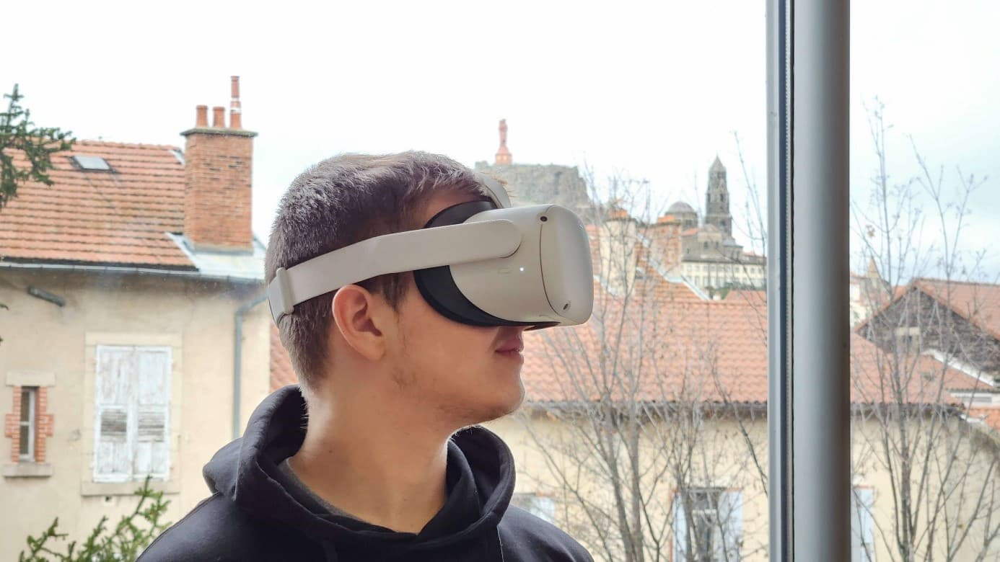

+++
title = 'Un lieu pour libérer le potentiel créatif de nos futurs informaticiens'
date = 2022-12-28
draft = false
+++
  

*Depuis la rentrée 2022, le département informatique graphique met à disposition de ses étudiants une salle de créativité. Cet espace convivial a été créé dans l’optique de leur offrir les meilleures conditions pour travailler leur imagination tout en favorisant l’esprit collaboratif. Ils peuvent y échanger de manière libre et ludique afin de résoudre des problématiques, avancer sur leurs projets d’année ou remobiliser les compétences acquises durant la formation.*

## UN ESPACE POUR ENCOURAGER LA CRÉATIVITÉ, L’INNOVATION ET L’ESPRIT D’ÉQUIPE

Comme toute bonne salle de créativité pour informaticiens, elle est évidemment équipée d’ordinateurs. À la différence des salles de TP, ces PC sont utilisables même en dehors des heures de cours.

Pour que les étudiants puissent approfondir les enseignements autour de la Réalité Virtuelle (VR) et de la 3D, le lieu est doté de plusieurs casques VR et d’une imprimante 3D. Les moteurs de jeu et logiciels vus en classe sont disponibles sur les différents ordinateurs. Ainsi, les technologies utilisées et les enseignements dispensés en cours peuvent être réexploités. Nos futurs techniciens peuvent, par exemple, y tester, améliorer et repenser les jeux créés sous Unity ou Unreal Engine. La modélisation 3D, avec 3Ds Max ou Blender selon les affinités, peut également y être remobilisée.

.jpg "Piano droit de la salle de créativité du département Informatique Graphique, IUT du Puy-en-Velay")

Les équipements ne se limitent pas seulement à la 3D et à la Réalité Virtuelle. Les membres du Bureau Des Étudiants ont aménagé la salle avec un piano droit. Des tableaux blancs et fauteuils colorés invitent à se poser et à échanger. Cet espace qui s’étend sur deux pièces communicantes dispose de nombreux atouts pour permettre l’expression des talents artistiques de chacun.

## UNE SALLE DE CRÉATIVITÉ ÉVOLUTIVE

Afin de parfaire leur expérience créative et collaborative, la salle sera enrichie au fil des ans d’autres matériels. Par exemple, nous avons pour ambition de mettre à disposition des étudiants des cartes Arduino et Raspberry Pi. Ces « mini-ordinateurs » auxquels il est possible d’ajouter des extensions, comme des capteurs, pourront être manipulés par nos futurs techniciens en informatique. Les étudiants auront ainsi la possibilité d’éprouver les connaissances acquises en cours de systèmes embarqués puis de tester de nouveaux assemblages.

.jpg "Salle de créativité du département Informatique Graphique, IUT du Puy-en-Velay")

Grâce à cette salle de créativité, sur le temps de midi ou après les cours, les étudiants peuvent travailler sur leurs projets d’année, expérimenter de nouvelles idées ou se lancer dans la réalisation de projets personnels. Ils se sont rapidement approprié le lieu et ont prévu de le décorer prochainement pour en faire un véritable espace d’expression de leur créativité.

*Cette publication a été rédigée par [Maximilien HERR](https://www.linkedin.com/in/maximilien-herr/), étudiant en 2e année du BUT.*