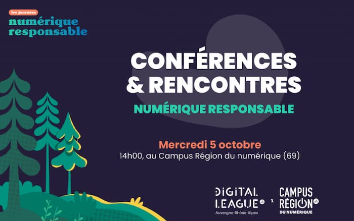

+++
title = 'Les journées du Numérique Responsable, deux jours pour programmer vert'
date = 2022-11-09
draft = false
tags = ["NR"]
+++
  

**_La notion de numérique responsable est au cœur de la formation Informatique Graphique de l’IUT du Puy-en-Velay. Pendant deux jours, les étudiants de deuxième année ont approfondi leurs connaissances et éprouvé leurs compétences dans le domaine._**

## LES JOURNÉES DU NUMÉRIQUE RESPONSABLE, QUÉSACO ?

Organisées par la [Digital League](https://www.digital-league.org/) au sein du [Campus Région du Numérique](https://campusnumerique.auvergnerhonealpes.fr/), les journées du Numérique Responsable (NR) s’ancrent parfaitement dans le défi écologique actuel. Au-delà des méthodes de programmation, le numérique responsable questionne l’ensemble de la chaîne de production des projets liés aux technologies de l’information (IT). De la fabrication des machines à leur fin de vie, en passant par leur utilisation, les appareils informatiques ne sont pas toujours très verts. C’est justement cette problématique qui est au cœur des journées du NR.

<figure>
  <picture>
    <!-- AVIF -->
    <source type="image/avif" srcset="img/Intro-768x481.avif">
    <!-- WebP -->
    <source type="image/webp" srcset="img/Intro-768x481.webp">
    <!-- JPEG de repli pour les navigateurs qui ne supportent ni AVIF ni WebP -->
    
  </picture>
</figure>

Le 5 octobre 2022, différents intervenants ont partagé leurs expertises et leurs pistes de réflexion pour un numérique responsable. Des entreprises et acteurs locaux, dont Sopht, la SNCF, EDF, Hardis Group et le département de la Loire ont proposé six projets – à réaliser sur un temps très court – aux huit équipes d’étudiants en présence. C’est sous la forme d’un hackathon, autrement-dit sous la forme d’un marathon de programmation d’une journée, que les étudiants du BUT informatique graphique ont pu mettre en pratique leurs compétences.

  

## CONFÉRENCES ET RENCONTRES DU NUMÉRIQUE RESPONSABLE

Ce concept de numérique responsable est encore assez récent dans l’IT. Ainsi, Anne-Sophie BANSE, Telman AZARMAHD, Romuald PRIOL et Amandine AUTHIER ont débuté la rencontre par une remise en contexte. Respectivement ingénieure environnement, ingénieur de recherche, développeur de services numériques responsables, et ingénieure éco-conception numérique, ces experts étaient qualifiés pour échanger avec les étudiants sur les enjeux actuels.

<figure>
  <picture>
    <!-- AVIF -->
    <source type="image/avif" srcset="img/Intervenants-Journees-du-Numerique-Responsable-768x512.avif">
    <!-- WebP -->
    <source type="image/webp" srcset="img/Intervenants-Journees-du-Numerique-Responsable-768x512.webp">
    <!-- JPEG de repli pour les navigateurs qui ne supportent ni AVIF ni WebP -->
    
  </picture>
  <figcaption><em>Experts à l’ouverture des journées du Numérique Responsable. Crédit : Digital League.</em></figcaption>
</figure>

Au premier abord, on peut considérer que le numérique responsable ne concerne que les hardwares et que c’est un concept étranger au développement. Pourtant, nos méthodes de programmation constituent le levier d’action pour une production numérique plus écologique. Par exemple, à la sortie de Pokémon Go, les experts ont observé un changement de téléphones plus élevé que la normale. En cause : une application qui n’était pas rétro-compatible, favorisant un changement anticipé des téléphones portables des utilisateurs. Cette aberration écologique a sûrement été doublée d’une absence de seconde vie pour ces appareils encore pleinement exploitables. Grâce à cet exemple, R. Priol, nous permet de comprendre que les logiciels, les applications et les sites web doivent être conçus de manière responsable.

Les statistiques montrent que le développement des capacités des produits technologiques va malheureusement de pair avec une augmentation des usages. De 1995 à 2020, le poids d’une page Web a été multiplié par 142. Aussi, de 2010 à 2020, 38 fois plus de données ont été consommées par foyer. Toutefois le coût énergétique lié à l’utilisation d’un appareil est à mettre en perspective avec celui de sa production ; 94% de la consommation d’électricité d’un smartphone tout au long de sa « vie » est liée à sa fabrication.

  

## HACKATHON DU NUMÉRIQUE RESPONSABLE

C’est à l’occasion du hackathon que les étudiants de deuxième année ont pu illustrer leurs savoir-faire. Ainsi, pendant une journée, ils ont été répartis dans différentes équipes, aux côtés d’étudiants d’autres écoles de la région. Chaque groupe était chargé d’un projet proposé par les entreprises. Projets techniques ou projets de recherches, les entreprises semblent avoir apprécié le format de ce marathon de programmation.

<figure>
  <picture>
    <!-- AVIF -->
    <source type="image/avif" srcset="img/Equipe-WireShark-Journees-du-Numerique-Responsable-768x512.avif">
    <!-- WebP -->
    <source type="image/webp" srcset="img/Equipe-WireShark-Journees-du-Numerique-Responsable-768x512.webp">
    <!-- JPEG de repli pour les navigateurs qui ne supportent ni AVIF ni WebP -->
    
  </picture>
  <figcaption><em>Pitch de l’équipe WireShark, avec à gauche Hugo Piat, au milieu Quentin Detré et à droite Loïc Pauvert, de l’IUT. Crédit : Digital League.</em></figcaption>
</figure>

Parmi les huit équipes, deux composées d’étudiants issus de l’IUT ont su se démarquer. EDF est à l’origine d’un premier projet. L’objectif ? « Mettre à disposition des salariés équipés d’un PC portable, un compagnon les guidant sur leurs manipulations de déconnexion au secteur pour contribuer au plan sobriété ». En fonction de la tension du réseau, une notification donne aux collaborateurs d’EDF des conseils pour diminuer leur consommation électrique. Cela s’inscrit dans la recherche de sobriété énergétique actuelle. L’équipe « EcoWatt », composée d’Eliot Bianchin, Colin Ferraton, Thibault Stouls, tous trois étudiants à l’IUT ainsi que d’Aley S., Alain S., Jeremy Sarre issus d’autres écoles participantes, a fini à la seconde place.

<figure>
  <picture>
    <!-- AVIF -->
    <source type="image/avif" srcset="img/Equipe-Ecowatt-Journees-du-Numerique-Responsable.avif">
    <!-- WebP -->
    <source type="image/webp" srcset="img/Equipe-Ecowatt-Journees-du-Numerique-Responsable.webp">
    <!-- JPEG de repli pour les navigateurs qui ne supportent ni AVIF ni WebP -->
    
  </picture>
  <figcaption><em>EcoWatt, le projet de sobriété énergétique avec EDF. Crédit : Maximilien Herr.</em></figcaption>
</figure>

L’entreprise Sopht a proposé le second projet portant sur la récupération en temps réel de la consommation de ressources d’un ensemble de containers dans un cluster Kubernetes. En d’autres termes, l’idée était de déployer un système pour surveiller les ressources utilisées par les serveurs. Dis comme ça, le sujet ne semble pas des plus simples, pourtant, c’est celui qui a remporté la première place. L’équipe était composée de Maximilien Herr, étudiant de [l’IUT Informatique en 2e année](https://ig.iut-clermont.fr/news/le-b-u-t-cest-quoi/), Boubakar Sall, Bilal Laatour, Amine B. et Kévin Ryckelynck.

Les journées du Numérique Responsable ont donc été d’une part un bon vecteur d’apprentissage pour les étudiants, mais d’autre part, le lieu pour illustrer leurs compétences dans ce domaine.

 Cette publication a été rédigée par [Maximilien HERR](https://www.linkedin.com/in/maximilien-herr/), étudiant en 2e année du BUT.