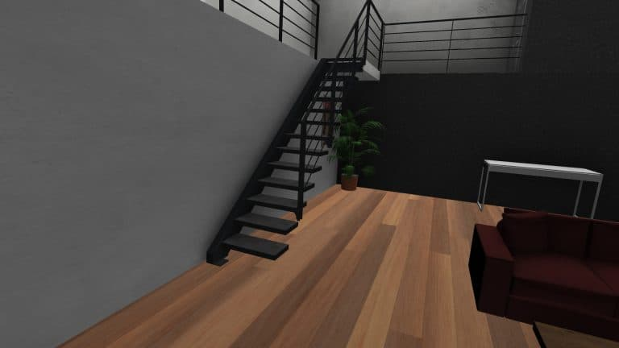

+++
title = 'Conception d’un showroom virtuel pour Stairkaze, une entreprise ponote d’escaliers en kit'
date = 2022-02-24
draft = false
+++
  

  

M. Laloux directeur de Stairkaze, entreprise française d’escaliers en kit personnalisables dont les produits sont confectionnés au Puy-en-Velay, s’interroge. « Un escalier en kit à monter chez soi ? Difficile pour mes clients de s’imaginer à quoi cela pourra ressembler. »

.jpg)

Pour répondre à leurs besoins et être en mesure de leur montrer les différents designs possibles avant l’achat, l’entreprise ponote souhaite créer une application de showroom, autrement-dit une salle d’exposition virtuelle de ses produits. C’est donc tout naturellement que Benjamin Laloux a fait appel aux compétences de nos techniciens supérieurs du département informatique de l’IUT pour monter ce projet.

Pierre-Yves Bischoff, professeur de mathématiques et d’informatique et M. Laloux, se sont réunis à la rentrée 2020 pour rédiger ensemble le cahier des charges destiné à notre équipe de six étudiants, composée de Maxime Poirier, Solène Tessiore, Frédéric Véron, Nathan Lefebvre, Karolane Picot et Wali Mohamadi.

   .jpg)L’équipe projet de conception du showroom Stairkaze : Maxime Poirier, Solène Tessiore, Frédéric Véron, Nathan Lefebvre, Karolane Picot et Wali Mohamadi.

Le projet démarré à l’automne 2020 s’est terminé en avril 2021. Nos étudiants s’en sont rapidement emparés et ont fonctionné en autonomie avec l’entreprise jusqu’à la livraison de l’application. **Le directeur M. Laloux se dit enchanté du résultat**. Depuis sa finalisation, l’application est utilisée par les collaboratrices de Stairkaze pour promouvoir les produits de la marque auprès de leurs clients.

Découvrez ci-dessous la présentation du showroom Stairkaze en vidéo !

  
https://www.youtube.com/watch?v=CR7Dt7p8b_c&embeds_referring_euri=https%3A%2F%2Fig.iut-clermont.fr%2F&source_ve_path=MjM4NTE&feature=emb_title
  

## UNE CONSTRUCTION PAS À PAS

Afin d’optimiser le temps de travail, nos six techniciens se sont répartis en deux groupes, programmation et modélisation, et progressaient en parallèle. Ils ont travaillé en méthode _Agile_. Les différents livrables étaient présentés au fur et à mesure au directeur sous forme de vidéos.

Maxime, Karolane et Wali se sont occupés de la partie modélisation. Wali avait pour mission de concevoir les différentes pièces du showroom. Maxime et Karolane, eux, ont travaillé à la modélisation et à la texture des marches et des garde-corps. Pour gagner en réalisme, Maxime a habillé les pièces en y ajoutant du mobilier, des effets d’ombre et de lumière.

   .jpg)Exemples de textures créées sur Substance Painter en bois de chêne, hêtre et acier brut

Du côté de la programmation, ce sont Frédéric, Nathan et Solène qui étaient aux commandes. Frédéric s’est occupé de toutes les fonctionnalités sans lien avec les objets modélisés, comme le placement des caméras et le changement de salle.

Le « pont informatique » entre les objets 3D et les fonctionnalités a été construit par Solène. « Je plaçais les objets modélisés dans le moteur _Unity_ et je m’assurais de faire le lien avec le code. » nous précise-t-elle. Enfin, Nathan a programmé les fonctionnalités de _texturing_.

La première étape du projet consistait en la production d’un échantillon de l’application. Nos étudiants ont d’abord travaillé sur un seul type d’escalier. Après avoir maitrisé le changement de la position des caméras ainsi que la possibilité de sélectionner quelques garde-corps et matériaux, ils ont pu enrichir l’application pour arriver au résultat final.

   Position caméra en vue contre-plongée

## UN PROJET OÙ CHAQUE MARCHE MÉRITE SA PEINE

Les difficultés rencontrées lors du projet ont fait monter en compétences nos étudiants. « J’ai passé un bon bout de temps à régler un problème de rotation. Quand je plaçais les objets 3D dans le moteur _Unity_, le point de pivot était mal placé, il se trouvait au centre. J’ai dû retravailler sur ce point pour chaque modélisation. » nous confie Solène.

« En ce qui me concerne, avant le projet, j’avais peu utilisé _Substance Painter_. Je me suis plongé sérieusement sur le fonctionnement de cet outil pour être capable de créer toutes les textures de métaux et de bois. » complète Maxime.

« L’importation des salles sur le moteur _Unity_ n’était pas de tout repos non plus puisque les salles arrivaient vides. Il a fallu toutes les refaire. » nous révèle Wali.

.jpg)

Pour mener à bien ce projet, les étudiants ont remobilisé les outils manipulés en cours :

*   _3DS Max_ et _Substance Painter_ ont servi à la production 3D
*   La programmation a été réalisée sous _Unity_
*   Les documents de communication ont été produits à partir d’_Affinity Designer_, _Photoshop_ ou encore _OBS Studio_ pour le montage vidéo.

Non seulement l’entreprise Stairkaze est satisfaite du résultat, mais les étudiants sont heureux d’avoir mené ce projet jusqu’au bout. « Cette expérience nous a permis de nous ouvrir au monde du travail et de monter en compétences. La gestion des plannings, des réunions et des échéances était très enrichissante. » nous explique Solène.

Nos six techniciens l’assurent, ils ont tous apprécié mettre en application leurs compétences en dehors du cadre scolaire et effectuer, par la même occasion, leurs premiers pas dans le monde professionnel.

[Retrouvez la présentation intégrale du showroom Stairkaze sur le site internet dédié !](https://showroom-stairkaze.alwaysdata.net/index.html)

.jpg)