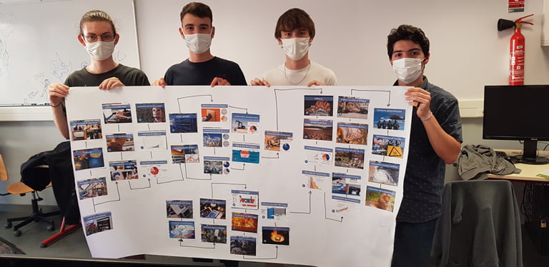
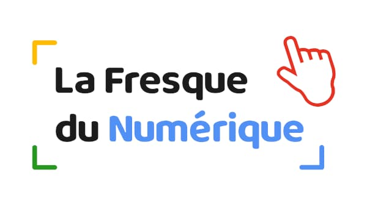

+++
title = 'Prendre conscience des enjeux environnementaux liés au digital grâce à une approche « learning by doing »'
date = 2021-10-27
draft = false
+++

  

 

  

## **LA FRESQUE DU NUMÉRIQUE, UN ATELIER PAR ET POUR DES PROFESSEURS ET ÉTUDIANTS ENGAGÉS**

 « Pendant longtemps, j’ai cherché à lier mes convictions **écologiques** et mon activité professionnelle. » nous confie Adelaïde Albouy-Kissi, maitre de conférences en informatique appliquée, engagée depuis plusieurs années au sein de l’[Institut du Numérique Responsable](https://institutnr.org/) et membre de son [Comité Scientifique](https://institutnr.org/le-conseil-scientifique).

À l’occasion de le Rentrée Climat, Adelaïde organise et anime les ateliers [La Fresque du Numérique](https://www.linkedin.com/company/la-fresque-du-num%C3%A9rique/). On vous en dit plus sur la genèse du projet et le contenu de cette formation.

 « En échangeant avec les étudiants, je me suis rendu compte qu’ils partageaient, pour beaucoup, la même **sensibilité environnementale** et souhaitaient se former à cette thématique. Si l’on en croit le [manifeste du réveil écologique](https://manifeste.pour-un-reveil-ecologique.org/fr/signatories) signé par plus de 32000 étudiant.e.s, c’est toute une génération qui semble en alerte sur ces problématiques. »

« Il y a deux ans, j’ai décidé de me former à l’animation d’outils pédagogiques tels que [La Fresque du Numérique](https://www.linkedin.com/company/la-fresque-du-num%C3%A9rique/). Cette approche est originale et ludique dans le sens où elle utilise le principe du _learning by doing_ qui mise sur l’intelligence collective et collaborative pour sensibiliser et résoudre des problèmes. Ici, il est question de s’interroger sur l’empreinte des activités numériques sur l’environnement. »

La mise en place du nouveau diplôme, le Bachelor Universitaire Technologique (BUT), à la rentrée 2021 est l’occasion de mettre ce sujet sur la table et de réfléchir – avec nos étudiants – aux actions concrètes à mettre en place pour évoluer vers un numérique plus soutenable.

  

## **SE QUESTIONNER, PRENDRE CONSCIENCE ET PROPOSER DES SOLUTIONS**

L’atelier se déroule en deux temps. La première partie constitue la phase de prise de conscience. Les étudiants s’interrogent sur les usages du numérique et leurs implications. C’est la partie la plus longue. Les participants disposent de trois heures pendant lesquelles ils vont créer, par groupe de quatre, une fresque.

.jpg)

  

Un premier lot de cartes, qui correspond à des usages numériques concrets (comme se divertir, communiquer…) est mis à leur disposition.

En début de fresque (à gauche), les élèves placent les différentes cartes puis se questionnent sur la fabrication des terminaux nécessaires aux usages identifiés (composants électroniques, outils numériques, ordinateurs, disques durs, serveur, data center, etc.). Ceci constitue le second lot de cartes.

.jpg)

La question des ressources et des déchets associés à ces usages est abordée avec un troisième lot de cartes. Les impacts sociétaux et éthiques (quatrième lot) et la santé (cinquième lot) permettent aux étudiants de couvrir l’ensemble des problématiques liées au numérique.

.jpg)

Cette phase de réflexion aboutit à la création d’une fresque qui lie de gauche à droite les usages du numériques à leurs implications matérielles, environnementales, éthiques, sociétales, sanitaires.  L’objectif de l’atelier est d’amener les participants à comprendre que, dans le numérique, « l’immatériel » n’existe pas. Pour chaque usage, il est bel et bien question d’extraction, d’importation, d’utilisation de ressources concrètes.

La dernière phase de l’atelier dure une heure. Les étudiants travaillent à l’élaboration d’une fresque des solutions. C’est un moment d’échange et de réflexion sur les comportements responsables à mettre en place afin de **tendre vers un numérique plus soutenable**.

.jpg)