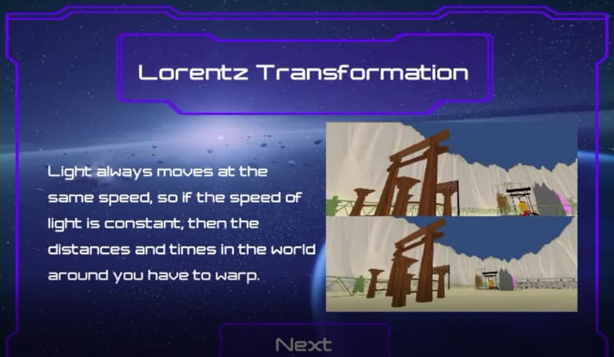
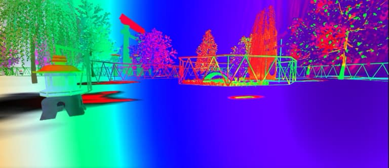
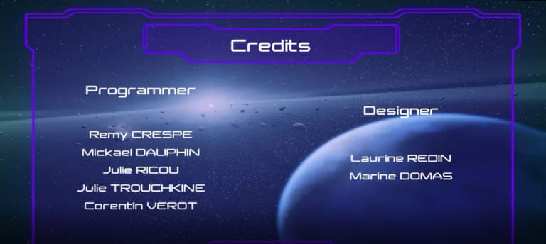

+++
title = 'Un jeu en Réalité Virtuelle pour comprendre le principe de la vitesse de la lumière'
date = 2021-09-07
draft = false
tags = ["Réalisation étudiant"]
+++

#### **QUAND L’INFORMATIQUE GRAPHIQUE EST AU SERVICE DE L’ASTROPHYSIQUE**

Au département Informatique Graphique, chaque année est synonyme de nouveaux projets et de nouvelles collaborations. En 2019, nos étudiants participent à l’adaptation d’un jeu en Réalité Virtuelle pour imager le principe de la vitesse de la lumière. Ils seront soutenus par M. Roland Lehoucq astrophysicien au [**Commissariat à l’énergie atomique et aux énergies alternatives de Saclay, CEA**](https://www.cea.fr/Pages/le-cea/les-centres-cea/paris-saclay.aspx) et félicités par M. Philip Tan _creative director_ pour le [**Massachusetts Institute of Technology, MIT**](https://www.mit.edu/) Game Lab.

<figure>
  <picture>
    <!-- AVIF -->
    <source type="image/avif" srcset="img/001-vitesse-de-la-lumiere-mode-doppler-aberration-transformation.avif">
    <!-- WebP -->
    <source type="image/webp" srcset="img/001-vitesse-de-la-lumiere-mode-doppler-aberration-transformation.webp">
    <!-- JPEG de repli pour les navigateurs qui ne supportent ni AVIF ni WebP -->
    
  </picture>
  <figcaption><em>Capture d’écran du jeu « Speed Of Light » révisé par les étudiants du département Informatique Graphique
</em></figcaption>
</figure> 

## **La genèse du projet**

Tout commence en 2018 lorsque Isabelle Portail, enseignante en production 3D, reprend contact avec M. Roland Lehoucq, astrophysicien au CEA ; elle l’avait rencontré en 2016 au [festival d’astronomie de Fleurance](https://www.festival-astronomie.com/) et il était venu l’année suivante à l’IUT du Puy-en-Velay pour donner une conférence.

« **Comment les compétences de nos futurs techniciens supérieurs en informatique graphique pourraient être utiles à l’astrophysique ?** » interroge Isabelle. M. Lehoucq propose de faire travailler les étudiants sur un jeu déjà réalisé par le MIT. Ce jeu modélise le principe de vitesse de la lumière. Le code est libre de droit mais personne ne l’a jusqu’alors vraiment revisité.

<figure>
  <picture>
    <!-- AVIF -->
    <source type="image/avif" srcset="img/mit-et-cea-768x273.avif">
    <!-- WebP -->
    <source type="image/webp" srcset="img/mit-et-cea-768x273.webp">
    <!-- JPEG de repli pour les navigateurs qui ne supportent ni AVIF ni WebP -->
    
  </picture>
  <figcaption><em>À gauche le Massachusetts Institute of Technology, MIT, et à droite le Commissariat à l’énergie atomique et aux énergies alternatives de Saclay, CEA
</em></figcaption>
</figure> 

## **1ère étape : Comprendre**

Pour mener à bien ce projet, Isabelle constitue une équipe composée d’étudiants de deuxième année : Remy Crespe, Mickaël Dauphin, Marine Domas, Laurine Redin, Julie Ricou, Julie Trouchkine et Corentin Vérot.

Les étudiants doivent faire appel à plusieurs compétences. Il leur faut comprendre le code du jeu existant. Il leur faut aussi s’initier au principe de la relativité générale et restreinte d’Einstein ainsi qu’au phénomène de déformations physiques et spectrales. Rien que ça !

Les étudiants doivent également mettre leurs compétences linguistiques à contribution. C’est avec l’aide de M. Hengl, enseignant d’anglais, qu’ils ont travaillé la compréhension de films, la traduction de termes scientifiques mais surtout la compréhension de termes informatiques permettant de s’approprier le code du jeu.

<figure>
  <picture>
    <!-- AVIF -->
    <source type="image/avif" srcset="img/trombinoscope-speed-of-light-1.avif">
    <!-- WebP -->
    <source type="image/webp" srcset="img/trombinoscope-speed-of-light-1.webp">
    <!-- JPEG de repli pour les navigateurs qui ne supportent ni AVIF ni WebP -->
    
  </picture>
</figure> 

## **2e étape : Imaginer, proposer et s’adapter**

À l’aide d’un cahier des charges fourni par Isabelle Portail, les étudiants soumettent une première idée de design pour le jeu. Roland Lehoucq n’est pas convaincu et propose de travailler sur une représentation plus simple. Les étudiants, bien qu’un peu déçus, se remettent au travail sous les encouragements d’Isabelle.

Afin de mieux saisir les enjeux scientifiques du projet, tous conviennent qu’il est nécessaire de se rencontrer. Roland Lehoucq, depuis Saclay, se rend disponible pour une visioconférence. Il donne un cours concis, clair et précis sur la relativité générale et restreinte d’Einstein aux étudiants.

Ces derniers saisissent l’occasion pour échanger avec lui sur les attentes concernant le design. L’idée d’un circuit « à la Mario Cars » semble convenir à tous. Il s’agit de permettre au joueur d’avancer sur une carte à la vitesse de la lumière et de représenter les déformations physiques et spectrales auxquelles seraient soumis le décor et les objets sur sa route.

<figure>
  <picture>
    <!-- AVIF -->
    <source type="image/avif" srcset="img/mario-kart-live-home-circuit-switch-dee294d5-768x432.avif">
    <!-- WebP -->
    <source type="image/webp" srcset="img/mario-kart-live-home-circuit-switch-dee294d5-768x432.webp">
    <!-- JPEG de repli pour les navigateurs qui ne supportent ni AVIF ni WebP -->
    
  </picture>
  <figcaption><em>Capture d’écran de Mario Cars ayant inspiré la navigation et le design du projet
</em></figcaption>
</figure> 

## **Dernière étape : Développer et tester**

Le projet finalisé, l’équipe avait prévu de se rendre au CEA pour rencontrer en personne M. Lehoucq et lui faire essayer le jeu en Réalité Virtuelle. Le Covid les a stoppés dans leur élan mais espérons que cela ne soit que partie remise !

Dans un même temps, Isabelle a soumis le projet fini à M. Philip Tan, _creative director_ au MIT Game Lab, qui a chaudement félicité toute l’équipe. Il leur a même confié que sa jeune fille avait testé et approuvé le jeu !

<figure>
  <picture>
    <!-- AVIF -->
    <source type="image/avif" srcset="img/016-vitesse-de-la-lumiere-explications-768x447.avif">
    <!-- WebP -->
    <source type="image/webp" srcset="img/016-vitesse-de-la-lumiere-explications-768x447.webp">
    <!-- JPEG de repli pour les navigateurs qui ne supportent ni AVIF ni WebP -->
    
  </picture>
  <figcaption><em>Capture d’écran du jeu finalisé. Ici, une explication en anglais du principe des transformations de Lorentz
</em></figcaption>
</figure> 

Le jeu a également été envoyé au [SATIS, Salon des Technologies de l’Image et du Son](https://satis-expo.com/) dans le cadre du [360 Film Festival](https://satis-expo.com/360-film-festival/) (festival des contenus en Réalité Virtuelle, Réalité Augmentée et Grands Formats). Bien que le projet n’ait pas été primé, cela a permis de lui donner plus de résonance.

<figure>
  <picture>
    <!-- AVIF -->
    <source type="image/avif" srcset="img/012-vitesse-de-la-lumiere-mode-doppler-aberration-transformation-1-768x347.avif">
    <!-- WebP -->
    <source type="image/webp" srcset="img/012-vitesse-de-la-lumiere-mode-doppler-aberration-transformation-1-768x347.webp">
    <!-- JPEG de repli pour les navigateurs qui ne supportent ni AVIF ni WebP -->
    
  </picture>
</figure> 

<figure>
  <picture>
    <!-- AVIF -->
    <source type="image/avif" srcset="img/004-vitesse-de-la-lumiere-mode-doppler-aberration-transformation-768x333.avif">
    <!-- WebP -->
    <source type="image/webp" srcset="img/004-vitesse-de-la-lumiere-mode-doppler-aberration-transformation-768x333.webp">
    <!-- JPEG de repli pour les navigateurs qui ne supportent ni AVIF ni WebP -->
    
  <figcaption><em>Captures d’écran du jeu finalisé. Ici, on peut voir les déformations de formes et de couleurs lors du déplacement du joueur à la vitesse de lumière.
</em></figcaption>
</figure> 

Le recours à la Réalité Virtuelle est en pleine expansion. Certaines connaissances scientifiques peuvent être parfois diffic

iles à se représenter comme ici avec la vitesse de lumière. Les cours théoriques sont utiles mais pas forcément suffisants. La Réalité Virtuelle prend alors tout son sens pour s’inscrire comme une étape supplémentaire dans la vulgarisation des connaissances. Le département Informatique Graphique et ses étudiants sont ravis de prendre part à cette avancée.

<figure>
  <picture>
    <!-- AVIF -->
    <source type="image/avif" srcset="img/019-vitesse-de-la-lumiere-Credits-768x344.avif">
    <!-- WebP -->
    <source type="image/webp" srcset="img/019-vitesse-de-la-lumiere-Credits-768x344.webp">
    <!-- JPEG de repli pour les navigateurs qui ne supportent ni AVIF ni WebP -->
    
  </picture>
  <figcaption><em>Crédits du jeu « Speed of Light 
</em></figcaption>
</figure> 